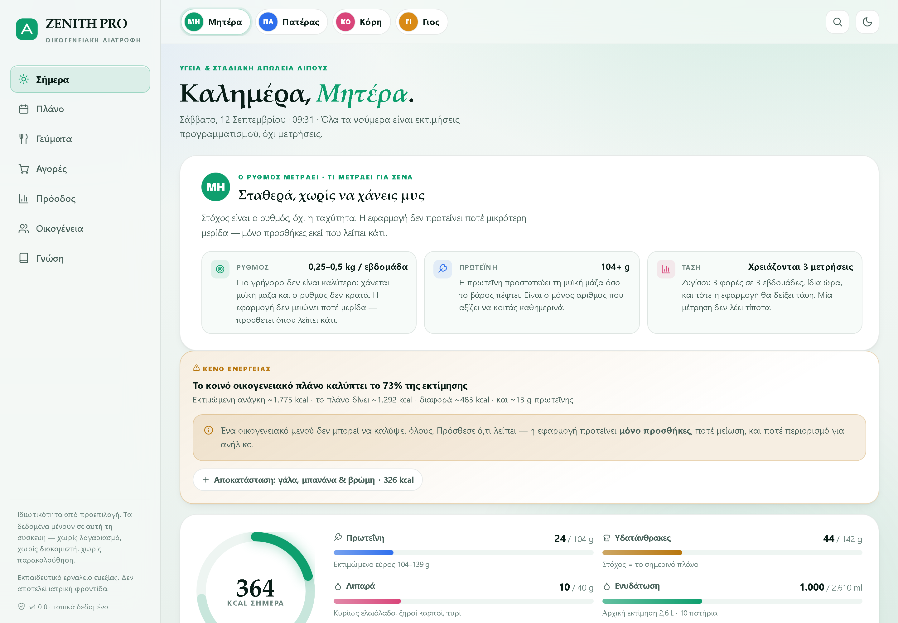
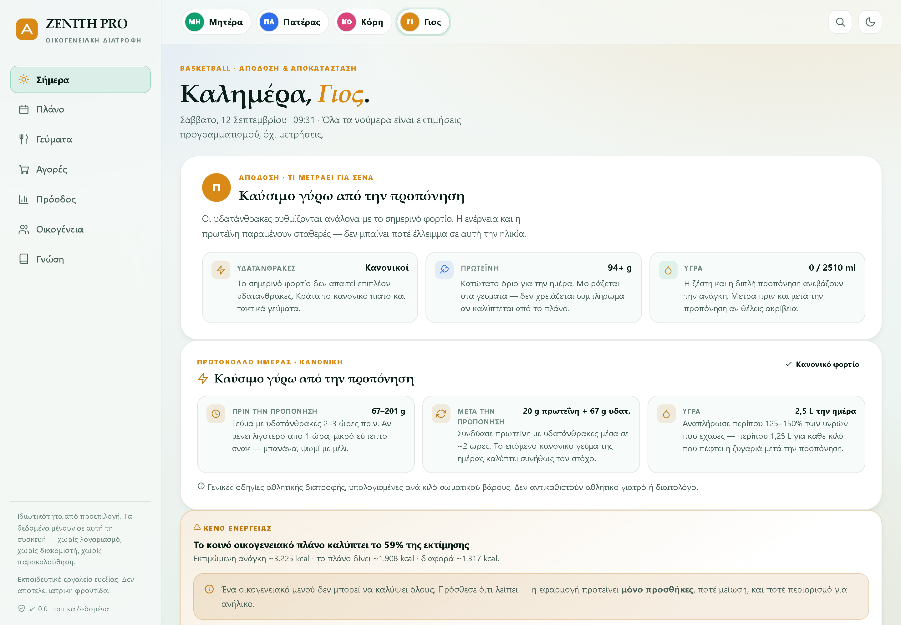
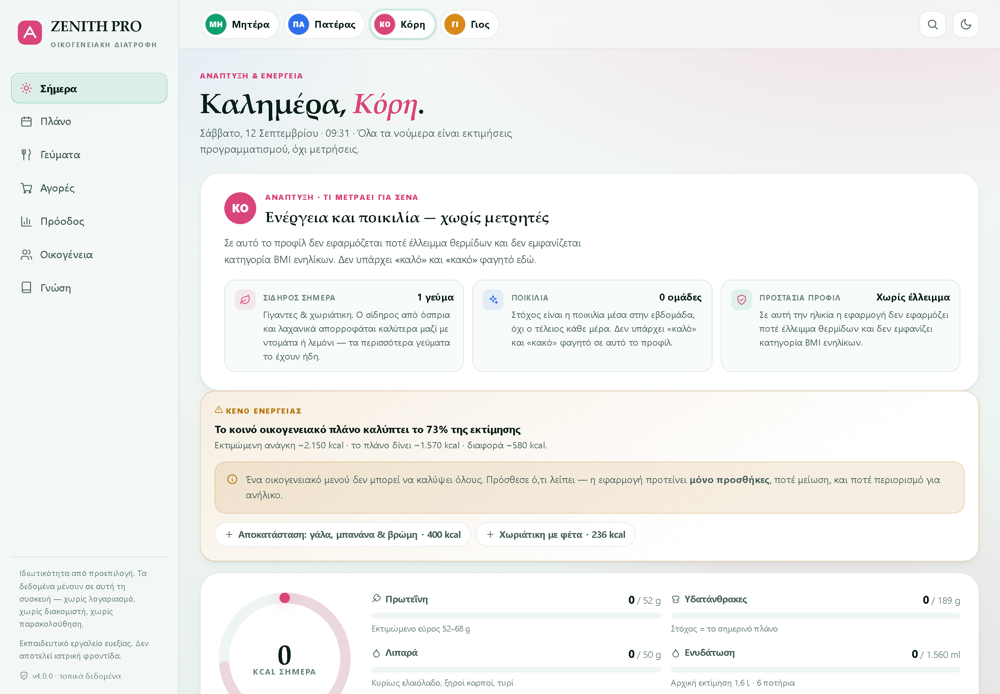
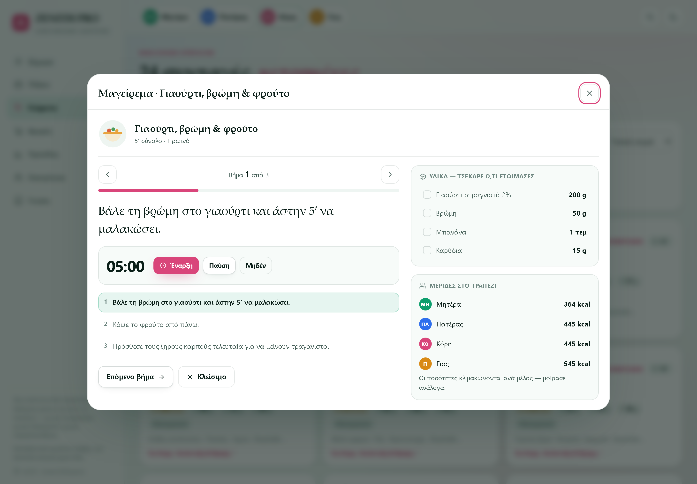

# ZENITH PRO v4 · Family Nutrition OS

Privacy-first, offline-first family nutrition PWA built around one shared family meal
system with member-specific portion logic. Greek-language UI, zero runtime dependencies,
no build step, hosted as static files on GitHub Pages.

**Live:** https://douphealth.github.io/family-nutrition-os/

## Screenshots

| Today (mother) | Today (son — fuelling) |
|---|---|
|  |  |

| Today (daughter — growth) | Cook Mode |
|---|---|
|  |  |

| Meals | Shopping |
|---|---|
|  |  |

| Shopping — how quantities are derived | Recipe (per-member portions) |
|---|---|
|  |  |

| Plan | Progress |
|---|---|
|  |  |

| Family | Dark theme |
|---|---|
|  |  |

Regenerate with `python scripts/capture_shots.py` while a local server is running.

## What's new in v4

v3 was correct. **v4 is personal** — it is built around the three people who actually use
it: the mother (51, gradual fat loss, does the cooking), the son (15, basketball) and the
daughter (17, growing).

### Easy for the mother
- **Cook Mode** — one instruction on screen at a time, large type, a progress bar, a
  clickable step list, an ingredient checklist and the plated portions for all four
  members. Built for someone standing at the stove.
- **Automatic step timers** — `parseStepTimers()` reads `25′`, `12'` and `200°C` out of the
  recipe text and offers start/pause/reset, with a toast, a notification and haptics.
- **A shopping list that behaves like a shop** — filter chips **Όλα / Απομένουν / Στο
  καλάθι**, a per-aisle `3/17` counter that turns green when complete, and a copy action
  that copies exactly what the active filter shows.

### Easy for the son (athlete)
- **Fuelling protocol card** — athlete-only. Pre-session carbohydrate **1–3 g/kg**
  (67–201 g), post-session **0,3 g/kg protein + 1 g/kg carbohydrate** (20 g + 67 g), and
  fluid at **125–150 %** of losses, with a daily litre target.

### Easy for the daughter (growth)
- **Growth brief, not a diet brief** — iron today (from `IRON_RICH` recipes), weekly
  variety, and an explicit protection tile: no deficit, no adult BMI category.

### Credibility
- **Persona focus points** — exactly three per member, chosen by goal, each with a live
  value. The mother sees rate-of-loss, protein floor and "3 measurements needed" instead
  of one day's number.
- **Honest shopping maths** — quantities were previously multiplied by head-count while
  the UI claimed they reflected each person's portions. `memberShare()` /
  `householdServings()` now scale per member, so a 0,75× carber and a 1,35× fuelled
  athlete are no longer counted as the same eater. The household share is **4,1 reference
  servings**, not 4 — and the app says so in an expandable explanation.
- **Recipe illustrations** — 13 inline-SVG motifs mapped to all 24 recipes, offline-safe
  and theme-aware.

## What's new in v3

### Credibility
- **Energy is derived, never stored.** Every calorie figure is computed from protein /
  carbohydrate / fat using Atwater factors (4 / 4 / 9 kcal per gram). Recipes, meals and
  daily totals can no longer disagree with each other.
- **Citation registry.** Nine canonical sources (CDC, BJSM, EFSA, WHO, ACSM…) are
  registered in `src/data.js` with a `used` field tying each one to the specific claim it
  backs. Nothing is cited that isn't actually relied on.
- **Honest coverage reporting.** The app reports exactly how much of each target the plan
  delivers, and — when there is a genuine gap — proposes *additions only*. It never
  suggests eating less.

### Reliability
- **IndexedDB with a localStorage fallback.** If IndexedDB is unavailable the app
  degrades silently to localStorage and tells you which backend is active.
- **In-place schema upgrade.** The database name is intentionally unchanged
  (`zenith-pro-v2`) with `DB_VERSION` bumped 1 → 2, so existing installs migrate with
  **no data loss**.
- **Validated, atomic import.** Backups are schema-checked (v1 and v2 accepted) before
  anything is written.
- **Error boundary + service-worker update detection.** A failed render shows a recovery
  screen instead of a blank page; a new deploy surfaces an "update available" prompt.
- **Three test suites in CI** plus a live-deployment smoke workflow that waits for GitHub
  Pages and asserts the deployed bundle actually changed.

### Usability
- **7 views** with a real navigation shell: Today, Plan, Meals, Shopping, Progress,
  Family, Guide — plus mobile bottom tab bar and a command palette (`Ctrl/⌘ + K`).
- **Undo on destructive actions** via toast actions; every destructive flow confirms first.
- **Editable family members**, meal portion multipliers that are *actually applied* to the
  macros you see, water logging, extra/skipped meals, and printable day sheets.
- **Full keyboard support**: `1`–`7` to switch views, `T` for theme, `Esc` closes sheets,
  focus-trapped dialogs, visible focus rings, and a `prefers-reduced-motion` path.

### Craft
- Token-driven design system with light/dark theming, an animated aurora background, data
  visualisations drawn as inline SVG (rings, macro bars, trend lines, adherence heatmap,
  bar charts), skeleton states, and a print stylesheet.
- 24 Greek-Mediterranean recipes with quantified ingredients and step-by-step method.
- All interpolated content passes through `esc()` — no XSS surface.

## Safety model

ZENITH PRO is an educational wellness tool, not medical care. Adolescent profiles are
structurally protected: **no deficit goal and no adult BMI category is offered below age
20** (`ADULT_BMI_AGE = 20`). This is enforced in the nutrition engine *and* re-checked in
the profile form submit handler, so it cannot be bypassed through the UI. The
"only additions" rule is surfaced in the daughter's persona card, in the shopping
transparency block and in the coverage card.

## Architecture

```
index.html              App shell (Greek lang, full meta/OG, aurora layer)
styles/app.css          Token-driven design system, light/dark, print
src/data.js             All content. Zero I/O.
src/nutrition-engine.js Pure functions. All physiology + statistics.
src/storage.js          IndexedDB (+ localStorage fallback), backup/import.
src/ui.js               Rendering primitives, icons, SVG charts, sheets, toasts.
src/views.js            Pure render functions returning HTML strings.
src/app.js              State, boot, routing, one delegated event dispatcher.
sw.js                   Network-first navigation, stale-while-revalidate assets.
```

Views are pure: they return HTML with `data-act` attributes. `app.js` owns all state and
handles every interaction through a single delegated click listener. Cook Mode state lives
outside the persisted `state` object, so transient cooking UI is never saved.

## Local development

```bash
npm run serve      # python3 -m http.server 8080
```

There is no build step. Edit a file, reload the browser.

## Tests

```bash
npm test           # nutrition-engine + data-integrity + persona & kitchen suites
npm run smoke      # DOM smoke test: localStorage path AND IndexedDB path (112 checks)
npm run check      # syntax check every module
```

The DOM smoke test boots the real `index.html` in jsdom, imports the real `src/app.js`,
and drives all seven views and the primary interactions end to end — including the persona
briefs, Cook Mode and the shopping filters. It requires `jsdom` and `fake-indexeddb`, which
are dev-only:

```bash
npm install        # installs devDependencies
npm run smoke
```

## License

See `LICENSE`.
