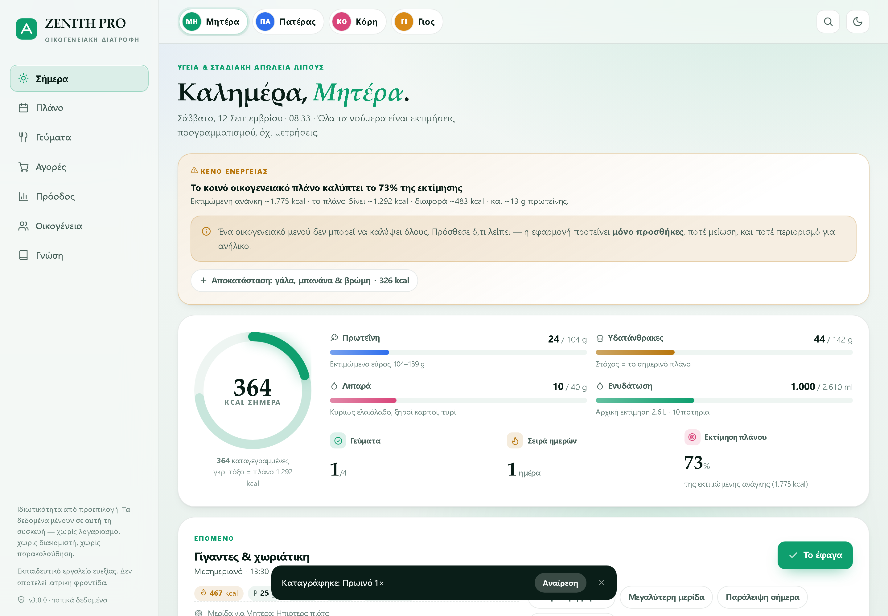
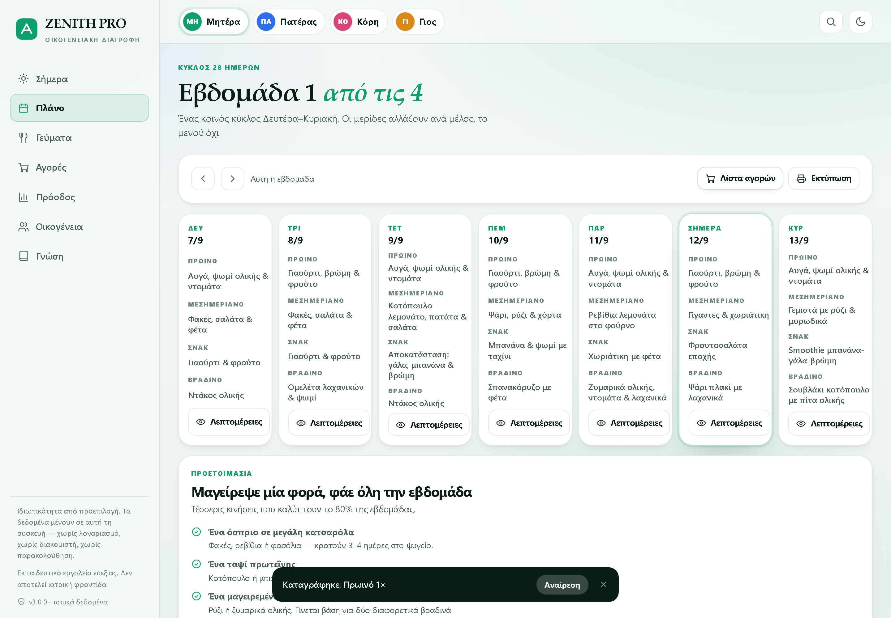
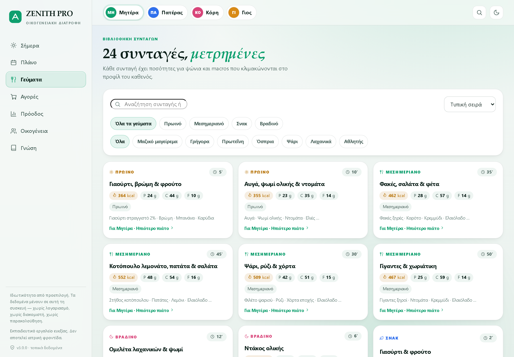
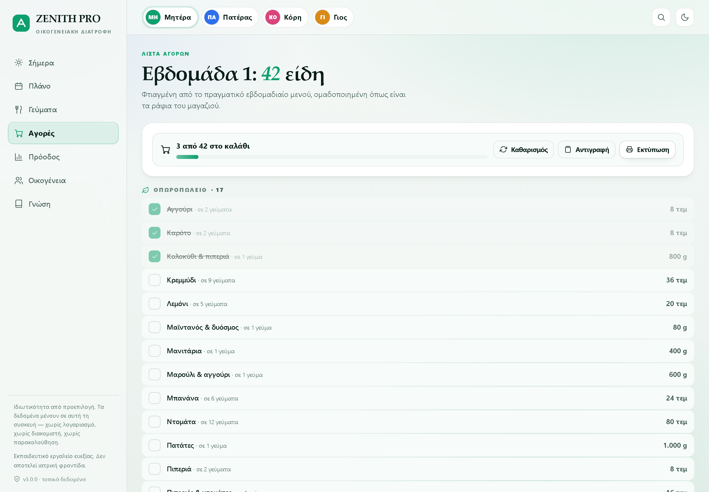
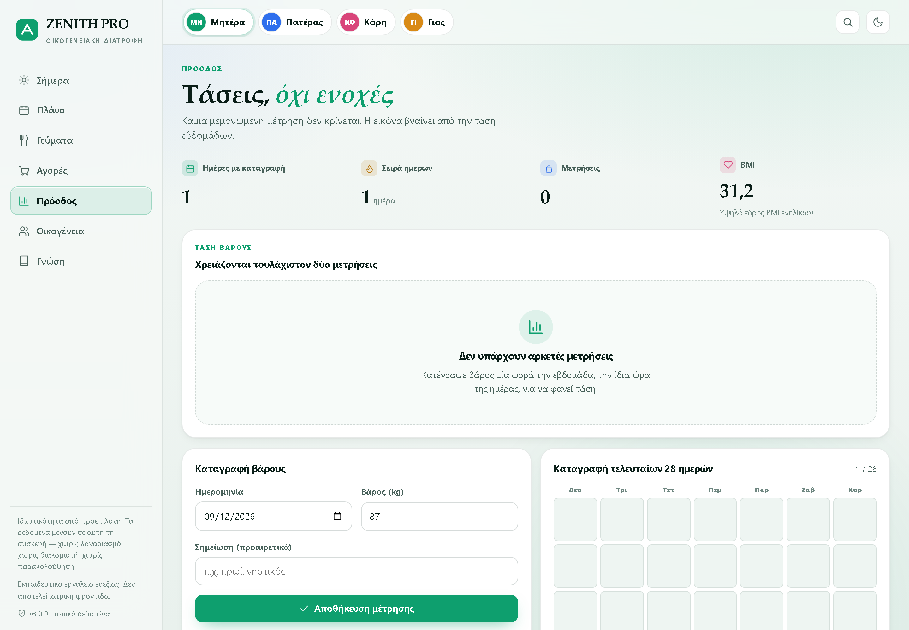
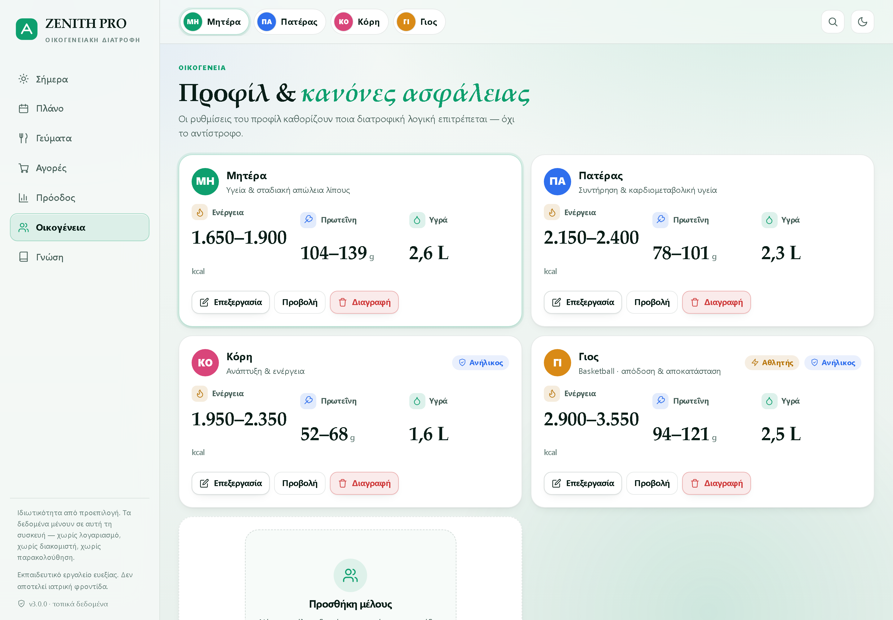
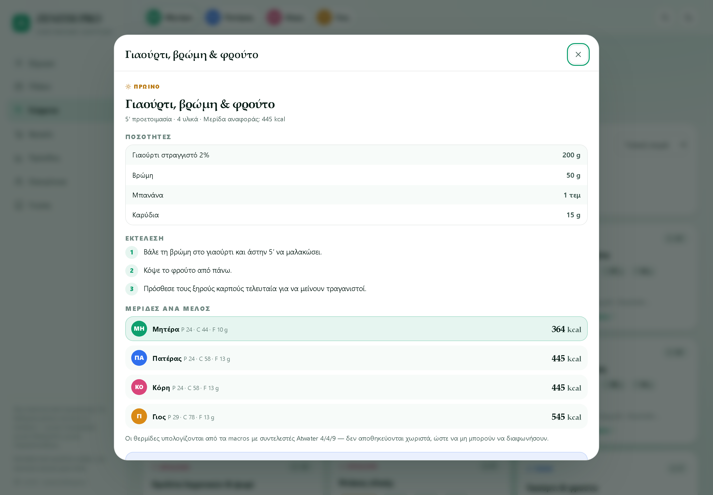
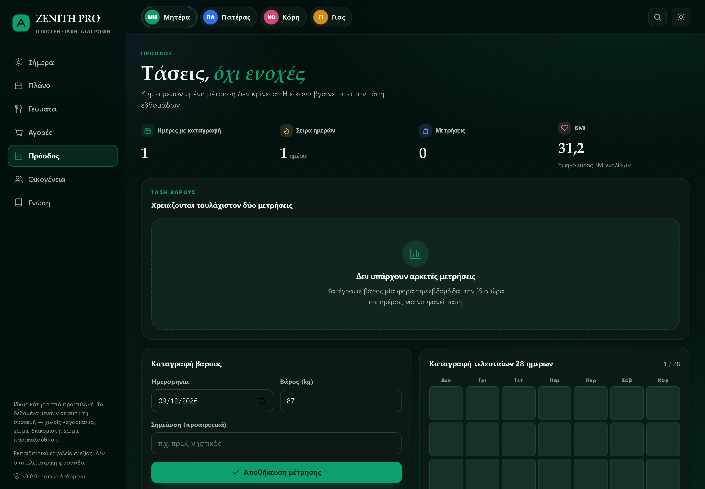

# ZENITH PRO v3 · Family Nutrition OS

Privacy-first, offline-first family nutrition PWA built around one shared family meal
system with member-specific portion logic. Greek-language UI, zero runtime dependencies,
no build step, hosted as static files on GitHub Pages.

**Live:** https://douphealth.github.io/family-nutrition-os/

## Screenshots

| Today | Plan |
|---|---|
|  |  |

| Meals | Shopping |
|---|---|
|  |  |

| Progress | Family |
|---|---|
|  |  |

| Recipe (per-member portions) | Dark theme |
|---|---|
|  |  |

Regenerate with `python scripts/capture_shots.py` while a local server is running.

## What's new in v3

### Credibility
- **Energy is derived, never stored.** Every calorie figure is computed from protein /
  carbohydrate / fat using Atwater factors (4 / 4 / 9 kcal per gram). Recipes, meals and
  daily totals can no longer disagree with each other.
- **Citation registry.** Nine canonical sources (CDC, BJSM, EFSA, WHO, ACSM…) are
  registered in `src/data.js` with a `used` field tying each one to the specific claim it
  backs. Nothing is cited that isn't actually relied on.
- **Honest coverage reporting.** The app reports exactly how much of each target the plan
  delivers, and — when there is a genuine gap — proposes *additions only*. It never
  suggests eating less.

### Reliability
- **IndexedDB with a localStorage fallback.** If IndexedDB is unavailable the app
  degrades silently to localStorage and tells you which backend is active.
- **In-place schema upgrade.** The database name is intentionally unchanged
  (`zenith-pro-v2`) with `DB_VERSION` bumped 1 → 2, so existing installs migrate with
  **no data loss**.
- **Validated, atomic import.** Backups are schema-checked (v1 and v2 accepted) before
  anything is written.
- **Error boundary + service-worker update detection.** A failed render shows a recovery
  screen instead of a blank page; a new deploy surfaces an "update available" prompt.
- **Two test suites in CI** plus a live-deployment smoke workflow that waits for GitHub
  Pages and asserts the deployed bundle actually changed.

### Usability
- **7 views** with a real navigation shell: Today, Plan, Meals, Shopping, Progress,
  Family, Guide — plus mobile bottom tab bar and a command palette (`Ctrl/⌘ + K`).
- **Undo on destructive actions** via toast actions; every destructive flow confirms first.
- **Editable family members**, meal portion multipliers that are *actually applied* to the
  macros you see, water logging, extra/skipped meals, and printable day sheets.
- **Full keyboard support**: `1`–`7` to switch views, `T` for theme, `Esc` closes sheets,
  focus-trapped dialogs, visible focus rings, and a `prefers-reduced-motion` path.

### Craft
- Token-driven design system (~900 lines of CSS) with light/dark theming, an animated
  aurora background, data visualisations drawn as inline SVG (rings, macro bars, trend
  lines, adherence heatmap, bar charts), skeleton states, and a print stylesheet.
- 24 Greek-Mediterranean recipes with quantified ingredients and step-by-step method.
- All interpolated content passes through `esc()` — no XSS surface.

## Safety model

ZENITH PRO is an educational wellness tool, not medical care. Adolescent profiles are
structurally protected: **no deficit goal and no adult BMI category is offered below age
20** (`ADULT_BMI_AGE = 20`). This is enforced in the nutrition engine *and* re-checked in
the profile form submit handler, so it cannot be bypassed through the UI.

## Architecture

```
index.html              App shell (Greek lang, full meta/OG, aurora layer)
styles/app.css          Token-driven design system, light/dark, print
src/data.js             All content. Zero I/O.
src/nutrition-engine.js Pure functions. All physiology + statistics.
src/storage.js          IndexedDB (+ localStorage fallback), backup/import.
src/ui.js               Rendering primitives, icons, SVG charts, sheets, toasts.
src/views.js            Pure render functions returning HTML strings.
src/app.js              State, boot, routing, one delegated event dispatcher.
sw.js                   Network-first navigation, stale-while-revalidate assets.
```

Views are pure: they return HTML with `data-act` attributes. `app.js` owns all state and
handles every interaction through a single delegated click listener.

## Local development

```bash
npm run serve      # python3 -m http.server 8080
```

There is no build step. Edit a file, reload the browser.

## Tests

```bash
npm test           # nutrition-engine + data-integrity suites
npm run smoke      # DOM smoke test: localStorage path AND IndexedDB path
npm run check      # syntax check every module
```

The DOM smoke test boots the real `index.html` in jsdom, imports the real `src/app.js`,
and drives all seven views and the primary interactions end to end. It requires `jsdom`
and `fake-indexeddb`, which are dev-only:

```bash
npm install        # installs devDependencies
npm run smoke
```

## License

See `LICENSE`.
