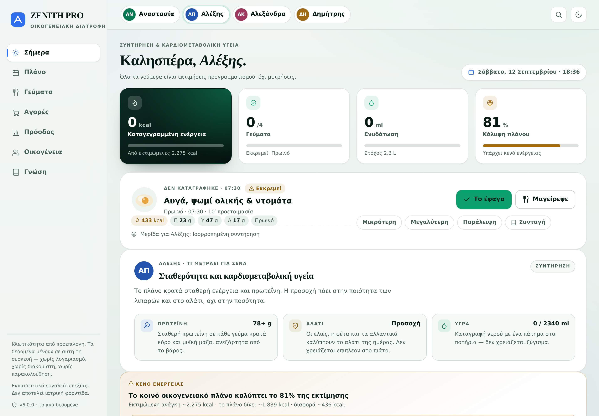
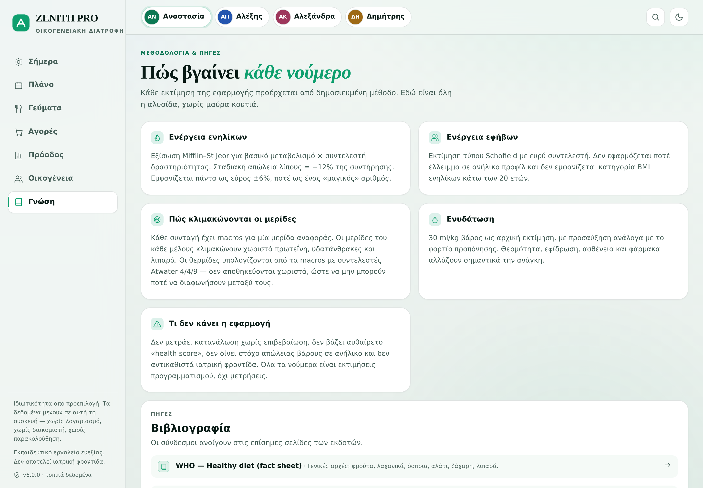
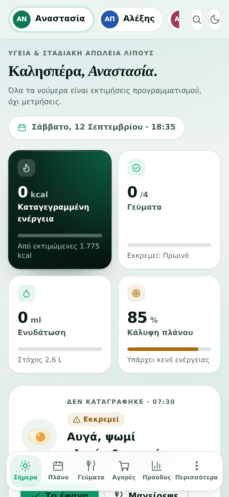
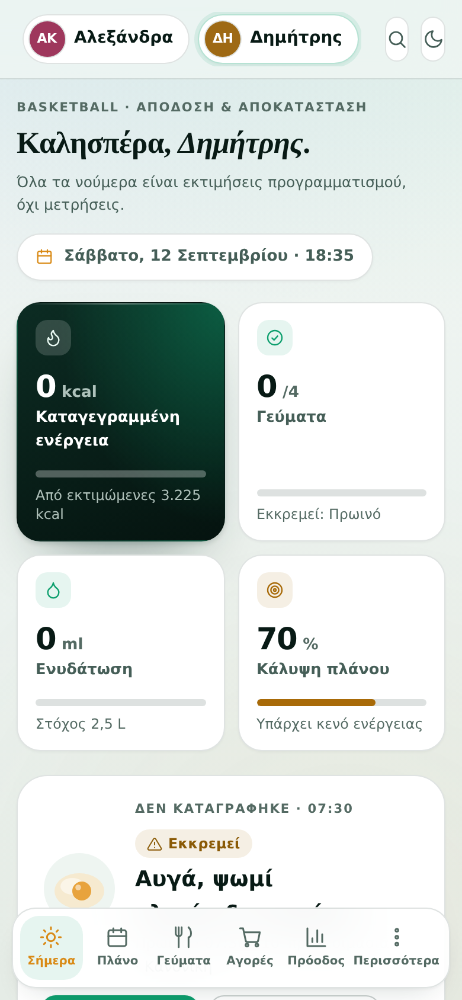
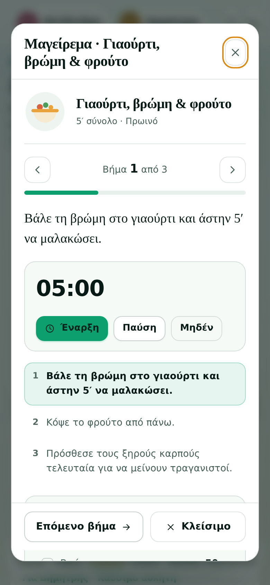
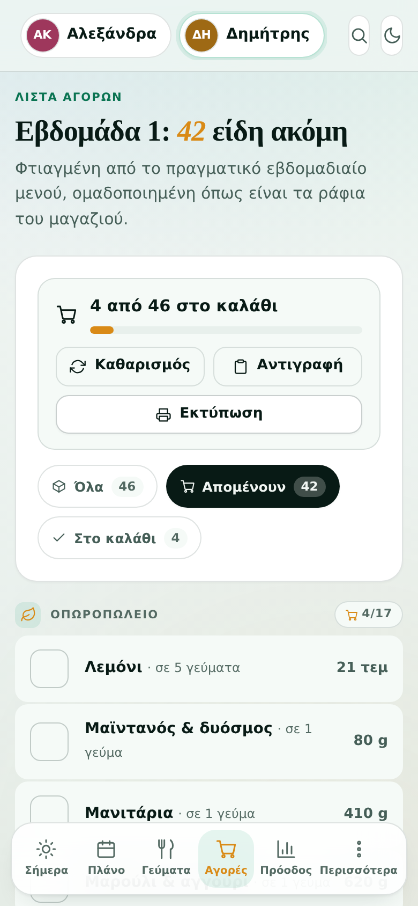
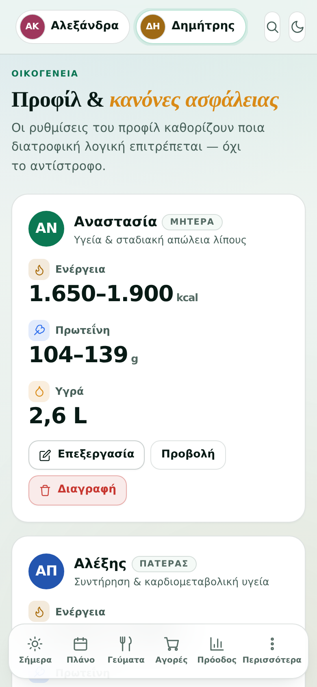

# ZENITH PRO v6 · Family Nutrition OS

Privacy-first, offline-first family nutrition PWA built around one shared family meal
system with member-specific portion logic. Greek-language UI, zero runtime dependencies,
no build step, hosted as static files on GitHub Pages.

**Live:** https://douphealth.github.io/family-nutrition-os/

## The household

The app is built around **four** real people, not a generic "user". `relation` is the
family role and `name` is what each of them is actually called; the member strip, avatars
and persona briefs all key off `name`. Renaming someone never touches `id`, so portions,
plans and history stay attached to the right person.

| | Name | Role | Age | Goal | Accent |
|---|---|---|---|---|---|
| `mother` | **Αναστασία** | Μητέρα | 51 | Gradual fat loss — she cooks | Emerald |
| `father` | **Αλέξης** | Πατέρας | 54 | Maintenance & cardiometabolic health | Aegean blue |
| `daughter` | **Αλεξάνδρα** | Κόρη | 17 | Growth & energy | Rose |
| `son` | **Δημήτρης** | Γιος | 15 | Basketball · performance & recovery | Amber |

> **Fixed in v6:** the README previously described "the three people who actually use it:
> the mother, the son and the daughter" and gave the father no section at all, while its
> title still said v4.2 against a shipped 5.0.0. The code always modelled all four
> correctly — only the documentation lost **Αλέξης**. The screenshot script had dropped
> him too, so `docs/screenshot-persona-father.png` did not exist. Both are fixed.

## Screenshots

| Αναστασία (mother) | Αλέξης (father) | Αλεξάνδρα (daughter) | Δημήτρης (son) |
|---|---|---|---|
|  |  |  |  |

| Today | Cook Mode |
|---|---|
|  |  |

| Meals | Shopping |
|---|---|
|  |  |

| Plan | Progress |
|---|---|
|  |  |

| Shopping — how quantities are derived | Recipe (per-member portions) |
|---|---|
|  |  |

| Family | Methodology & sources | Dark theme |
|---|---|---|
|  |  |  |

### On a phone — where the app actually gets used

| Today (mother) | Today (Δημήτρης, fuelling) | Cook Mode (pinned step nav) |
|---|---|---|
|  |  |  |

| Shopping (what's left) | Family |
|---|---|
|  |  |

Regenerate with `npm run shots` (desktop) and `npm run shots:mobile` (phone + layout
audit) while a local server is running on port 8137.

## What's new in v6

A correctness-and-craft release. The app was already honest about its numbers and already
worked offline; what it was not was *legible about itself*. Three of the four member
colours were colliding with the app's own status colours, the same four meals were drawn
three times on the Today screen, and the plan could not tell the time — at six in the
evening it still called a 07:30 breakfast "up next".

### One colour, one job

`--accent` used to be **three things at once**: the brand colour, the selected member's
identity, *and* the success colour. Selecting Αλέξης turned every progress bar blue — the
protein data hue. Selecting Δημήτρης turned them amber — the "energy gap" warning.
Selecting Αλεξάνδρα turned them pink — the "under target" hue. Three of four members had
a progress bar painted in a colour the UI uses for bad news.

Member colour now tints **identity surfaces only** — avatar, persona rail, active nav
rail, member chip. Progress is a fixed `--ok`, warnings a fixed `--warn`, macros their own
series. A progress bar can no longer change colour because a different family member is
looking at it.

**The hero card is no longer success-coloured.** It was filled with the accent, so a day
with **0 kcal logged** was painted in the colour that means "good". It is now a deep,
brand-lit signature card — and *lighter* in dark theme, where it has to separate from a
near-black background rather than darker. Still exactly one hero per row; the smoke suite
enforces it.

### The Today screen draws the day's meals once

They appeared three times: the next-meal card, the meal grid, and a "Χρονολόγιο" timeline.
The timeline is gone, the meal card folds its status line into the header row, and the
energy panel's three restatements of "recorded vs planned" are one legend.

**Measured at 390×844: 5,274 → 4,527 px (−14.2%).** Desktop −14.0%. The next-meal card
also moved *above* the persona brief, because "what do I do now" beats "what matters this
month" when someone opens the app with a pan already on.

### It knows what time it is

`nextMealNudge()` reports the next unlogged slot and whether it is `upcoming`, `due` or
`overdue`. The next-meal card carries a live state pill (Τώρα / Σε 42′ / Εκκρεμεί) and the
meals KPI says *which* meal is outstanding instead of promising "4 ακόμη σήμερα" at 21:00.

### Meal swapping

`swapCandidates()` ranks same-slot alternatives by how close they land to the original
**for that member** — a 0,75× adult and a fuelled athlete get different closest plates,
because the same recipe is a different dish for each. A swap is portion-neutral by
construction: it can offer a different plate, **never a smaller one**.

### Confirmed macros follow what was actually eaten

`dayMacros()` now honours a per-meal `recipeId` on the log entry, so logging "I had the
fish instead" updates CONFIRMED while PLANNED keeps describing the plan. Counting the
plan's dish would have reported intake that never happened — the exact failure this app
exists to prevent.

### Measured accessibility

A WCAG 2.1 audit reads **real computed colours** from the rendered app, resolves each
element's effective background through its ancestors, and applies the luminance formula
exactly. It found **94 failing text/colour combinations across 7 views × 2 themes**.

The root cause was systemic: the palette's colours are *fills*, and they were being used
as *text*. Emerald `#0E9F6E` is 3.39:1 as text on white and 3.02:1 on its own 10% tint —
so every eyebrow, link, status pill and slot tag built on it was failing. A colour legible
as a 7px bar is not automatically legible as 11px type.

Each fill now has a darker sibling that clears 4.5:1 against white **and** against its own
tint; fills keep the bright colour, type uses the text tier. Also fixed: `--ink-3` was
4.12:1 on white (every micro-label), white on the raw member accents failed for three of
four members (worst: Δημήτρης's amber at 2.76:1), and the primary button — filled with the
member colour — was the *least* legible control for one of the four people.

**Result: 254 measurable combinations, zero below AA.** The 6 that sit on a gradient-painted
surface cannot be derived from computed styles; they are verified by arithmetic instead
(worst case 4.58:1, on the brightest pixel of the signature card).

### Also

- **Numerals are sans and tabular.** KPI values, stat values and ring centres were set in
  `--font-display`, a system serif stack whose members (Georgia, Palatino, Iowan) carry
  **old-style figures** — digits at inconsistent heights, so `1.775` read as ragged and
  columns of shopping quantities never lined up. The serif is now reserved for headings.
- **Elevation is hairline-first.** Card shadows were heavy enough that everything read as
  floating; the card edge does the work. Radii 22 → 20px, spacing on a 4px ladder.
- **Micro-labels are one scale, not eight** (.62rem–.78rem with tracking .04–.15em).
- **Two members had identical avatars.** Αλέξης and Αλεξάνδρα share their first five
  letters, so both sliced to **ΑΛ** — identical badges centimetres apart, told apart only
  by colour. Initials now resolve against the whole household: shortest unique prefix
  (ΑΝ, ΔΗ), otherwise first name letter plus family role (**ΑΠ**, **ΑΚ**). The comparison
  is accent-folded, because the first attempt "resolved" them on the tonos alone — ΑΛΈ vs
  ΑΛΕ is unique in a string comparison and useless in an 11px badge.
- **`greeting()` had an unreachable branch** — `if (h < 18) return 'Καλησπέρα'; return
  'Καλησπέρα';` — two identical returns.
- **The macro chips are Greek**: Π / Υ / Λ, not Latin P / C / F.
- **The active shop filter is an ink pill**, and the weekly bar chart colours only today
  and greys the rest. Selective emphasis: the one mark carrying a signal gets the chroma.

## Architecture

```
index.html              App shell (Greek lang, full meta/OG, aurora layer)
styles/app.css          Token-driven design system, light/dark, print
src/data.js             All content. Zero I/O.
src/nutrition-engine.js Pure functions. All physiology + statistics.
src/storage.js          IndexedDB (+ localStorage fallback), backup/import.
src/ui.js               Rendering primitives, icons, SVG charts, sheets, toasts.
src/views.js            Pure render functions returning HTML strings.
src/app.js              State, boot, routing, one delegated event dispatcher.
sw.js                   Network-first navigation, stale-while-revalidate assets.
```

Views are pure: they return HTML with `data-act` attributes. `app.js` owns all state and
handles every interaction through a single delegated click listener. Cook Mode state lives
outside the persisted `state` object, so transient cooking UI is never saved.

The engine is pure by construction — no storage, no DOM, no clock. Where a function needs
the current time (`nextMealNudge`) the caller injects a `Date`, which is why its midnight
rollover is testable rather than something you discover in December.

## Local development

```bash
npm run serve      # python3 -m http.server 8080
```

There is no build step. Edit a file, reload the browser.

## Tests

```bash
npm test               # 256 assertions: engine + data-integrity + persona/kitchen
npm run smoke          # DOM smoke test: localStorage path AND IndexedDB path (129 checks)
npm run check          # syntax check every module
npm run shots:mobile   # phone-width render + layout audit (needs Playwright + a server on 8137)
npm run audit:selftest # proves the layout audit can actually fail
```

The DOM smoke test boots the real `index.html` in jsdom, imports the real `src/app.js`,
and drives all seven views and the primary interactions end to end — including the persona
briefs, Cook Mode and the shopping filters. It requires `jsdom` and `fake-indexeddb`, which
are dev-only:

```bash
npm install
npm run smoke
```

`npm run shots:mobile` needs Playwright and a local server on port 8137. jsdom has no
layout engine, so this is the only suite that can catch a mobile layout regression; it
runs in CI as its own job. It earned its keep in v6: adding a prose string to the
tabular-numerals rule made it 7px wider (tabular figures are wider *by design*) and burst
a card on the athlete's view — 397px against a 390px viewport, caught before release.

### One trap worth knowing before editing that audit

It must compare `documentElement.scrollWidth` against **`documentElement.clientWidth`**,
never `window.innerWidth`. Under Playwright's `is_mobile=True` the layout viewport grows
to accommodate the overflow, so `innerWidth` reports the inflated width and the assertion
silently becomes `405 <= 405` — passing while the page scrolls sideways. It did exactly
that for one release.

The same class of false positive bit the contrast audit twice, and both are now guarded:
a gradient-painted surface reports `backgroundColor: transparent`, so a naive ancestor
walk falls through the dark signature card and measures white-on-white (1.01:1); and
Chromium returns `color(srgb r g b)` — not `rgb()` — for anything produced by
`color-mix()`, so a parser handling only the legacy syntax reports every mixed surface as
transparent. **A measurement tool that cannot see the thing it is measuring will report
either a failure that isn't there or a pass that isn't.**

## Safety model

ZENITH PRO is an educational wellness tool, not medical care. Adolescent profiles are
structurally protected: **no deficit goal and no adult BMI category is offered below age
20** (`ADULT_BMI_AGE = 20`). This is enforced in the nutrition engine *and* re-checked in
the profile form submit handler, so it cannot be bypassed through the UI. The
"only additions" rule is surfaced in the daughter's persona card, in the shopping
transparency block and in the coverage card.

## License

See `LICENSE`.
