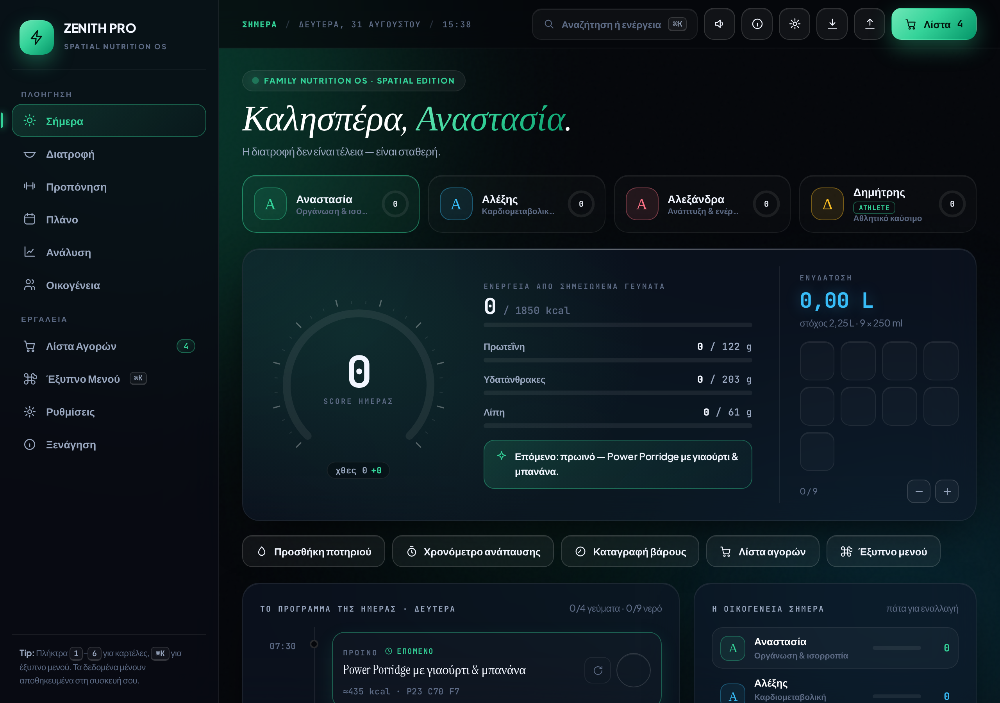
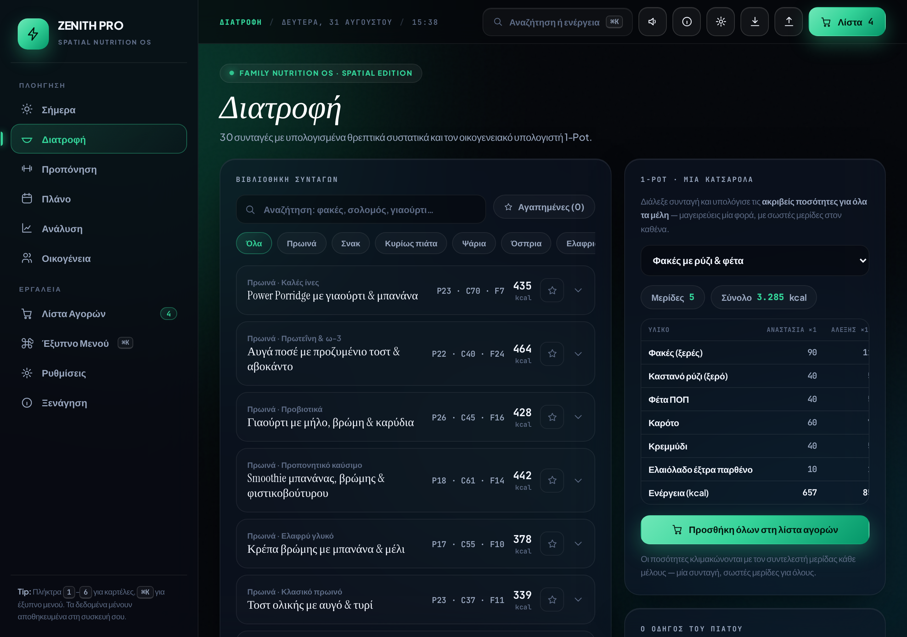
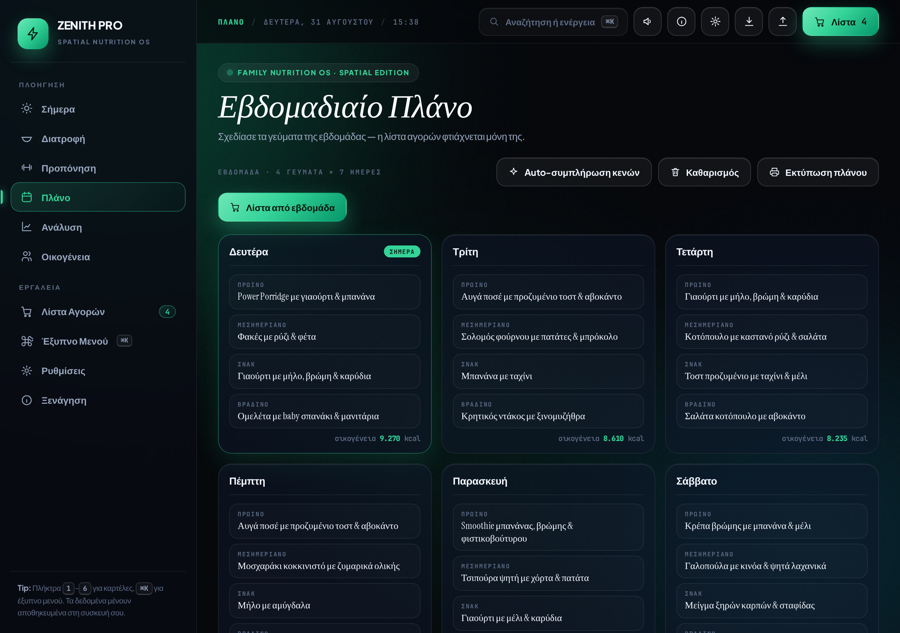

# ZENITH PRO · Οικογενειακή Διατροφή & Ευεξία

> **Ο οικογενειακός κόμβος διατροφής, ενυδάτωσης, ύπνου, προπόνησης και ευεξίας.**
> Λειτουργεί **100% offline**, χωρίς λογαριασμό, χωρίς αποστολή δεδομένων — τα δεδομένα μένουν στη συσκευή σου.

Ένα **Progressive Web App** (PWA) ενός αρχείου: εγκαθίσταται στο τηλέφωνο/tablet σαν κανονική εφαρμογή, ανοίγει από οπουδήποτε, και δουλεύει και χωρίς ίντερνετ. Σχεδιασμένο για να το χρησιμοποιεί **κάθε μέλος της οικογένειας, κάθε μέρα**.

---

## ✨ Δυνατότητες

### 👨‍👩‍👧‍👦 Προφίλ μελών
- Ξεχωριστό προφίλ για κάθε μέλος (μαμά, μπαμπάς, κόρη, γιος — ή ό,τι ταιριάζει στην οικογένειά σου)
- Αυτόματος υπολογισμός ενεργειακών αναγκών (BMR / TDEE / θερμίδες / πρωτεΐνες / υδατάνθρακες / λίπη)
- Εξατομικευμένο χρώμα, στόχοι, ρόλος και προσωπικό μότο

### 🍽️ Διατροφή & Γεύματα
- Καταγραφή 4 γευμάτων την ημέρα (πρωινό, μεσημεριανό, σνακ, βραδινό)
- **30 συνταγές** με πλήρη υπολογισμένα θρεπτικά συστατικά (kcal, πρωτεΐνη, υδατάνθρακες, λίπη)
- Βάση τροφίμων ~50 αντικειμένων, αγαπημένα, αναζήτηση & φίλτρα
- Υπολογιστής 1-Pot για οικογενειακή μερίδα με το χέρι

### 💧 Ενυδάτωση & Ύπνος
- Παρακολούθηση νερού με στόχο ανά μέλος
- Καταγραφή ύπνου και ενέργειας (bio)

### 🏋️ Προπόνηση
- 22 ασκήσεις σε 6 μυϊκές ομάδες, προγράμματα κυκλώματος
- Χρονόμετρο ανάπαυσης, υπολογιστής 1RM

### 📅 Εβδομαδιαίο Πλάνο & Ψώνια
- Σχεδιασμός γευμάτων για όλη την εβδομάδα
- **Λίστα αγορών που φτιάχνεται αυτόματα** από το πλάνο — ταξινομημένη ανά διάδρομο, με δυνατότητα εκτύπωσης

### 📊 Ανάλυση & Πρόοδος
- Τάσεις, βάρος, BMI, σερί ημερών, **12 διακρίσεις (achievements)** και Score της ημέρας

### 🔔 Υπενθυμίσεις & Backup
- Τοπική υπενθύμιση αν μένουν γεύματα που δεν καταγράφηκαν
- **Αυτόματο backup** σε εφεδρικό χώρο (recovery αν χαθεί το κύριο αντίγραφο)
- Χειροκίνητη εξαγωγή / εισαγωγή όλων των δεδομένων σε JSON

### ⚙️ Τεχνικά
- Πλήρως **offline-first** (Service Worker) — λειτουργεί χωρίς ίντερνετ
- **Εγκατάσταση** στο κινητό / desktop σαν native εφαρμογή
- Ασφαλές restore με **deep-merge** — τα backup συμβατά με μελλοντικές εκδόσεις
- Μηδενικά dependencies, ένα αρχείο HTML, άνοιγμα από παντού

---

## 🖼️ Προεπισκόπηση





---

## 🚀 Εγκατάσταση (για όλη την οικογένεια)

### Επιλογή Α — από το GitHub Pages (προτεινόμενη)
1. Άνοιξε το live URL της εφαρμογής (βλ. «Deploy» παρακάτω)
2. Στο τηλέφωνο/tablet: **Μενού του browser → «Προσθήκη στην αρχική οθόνη»**
3. Τέλος — η εφαρμογή ανοίγει σαν native app, offline και όλα.

### Επιλογή Β — τοπικά
Άνοιξε το `index.html` απευθείας σε Chrome/Edge/Safari. Λειτουργεί πλήρως και από αρχείο.

---

## 🛠️ Ανάπτυξη

```
git clone https://github.com/<owner>/family-nutrition-os.git
cd family-nutrition-os
# άνοιξε index.html ή σέρβιρέ το με όποιον static server θες:
python3 -m http.server 8080
```

Δομή:
```
family-nutrition-os/
├── index.html              # η εφαρμογή (ένα αρχείο, όλα μέσα)
├── manifest.webmanifest    # PWA manifest (εγκατάσταση)
├── sw.js                   # Service Worker (offline-first)
├── assets/                 # εικονίδια (icon-192/512/180, favicon)
└── scripts/gen_icons.py    # αναγέννηση εικονιδίων
```

Αναγέννηση εικονιδίων: `python3 scripts/gen_icons.py`

---

## 🔒 Απόρρητο

- **Χωρίς λογαριασμό, χωρίς servers, χωρίς αποστολή δεδομένων.** Όλα αποθηκεύονται τοπικά στο πρόγραμμα περιήγησης (localStorage).
- Τα backup είναι αρχεία JSON που κρατάς εσύ.
- Εκπαιδευτικό εργαλείο — **όχι ιατρική συμβουλή**.

---

## 📜 Άδεια
MIT — βλ. [LICENSE](LICENSE).

---

## 🇬🇧 English summary

Single-file, offline-first **family nutrition & wellness PWA** in Greek. Per-member profiles with automatic calorie/macro targets, 30 recipes with full nutrition, water/sleep/weight tracking, weekly meal planner with auto-generated shopping list, workout log with rest timer & 1RM calculator, analytics with BMI/trends, 12 achievements, local reminders, schema-safe auto-backup, and installable/offline PWA support. Zero dependencies, fully private (localStorage only).
