# ZENITH PRO · Family Nutrition OS

**One menu for the whole family — and a portion, in grams, for each person.**
Plan, cook, shop and log meals for four people at once. It works offline, needs no account and no server,
and every figure it shows is traceable to a public source.

**Live:** <https://douphealth.github.io/family-nutrition-os/> · Greek interface · installable as an app · v13.0.0 “Aegean”

<p align="center">
  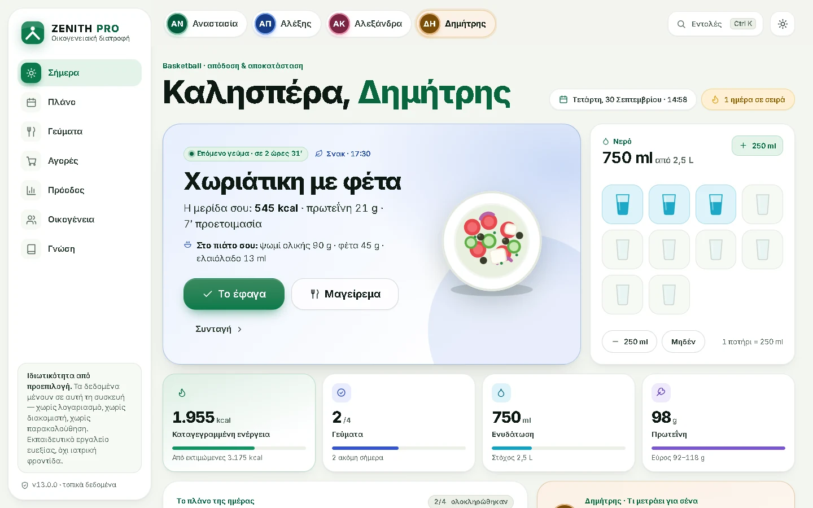
  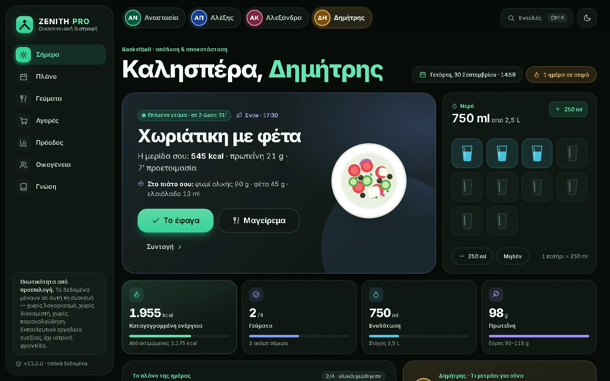
</p>
<p align="center">
  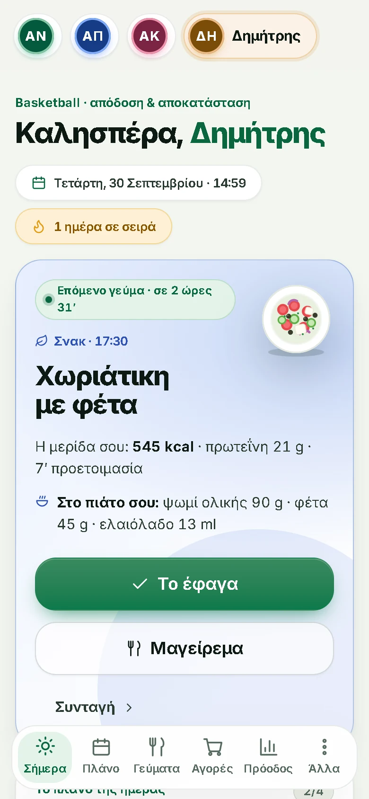
  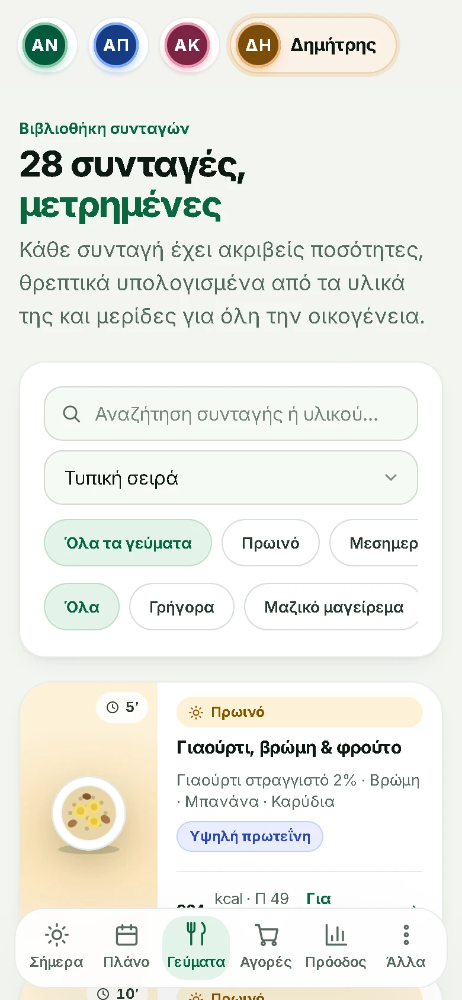
  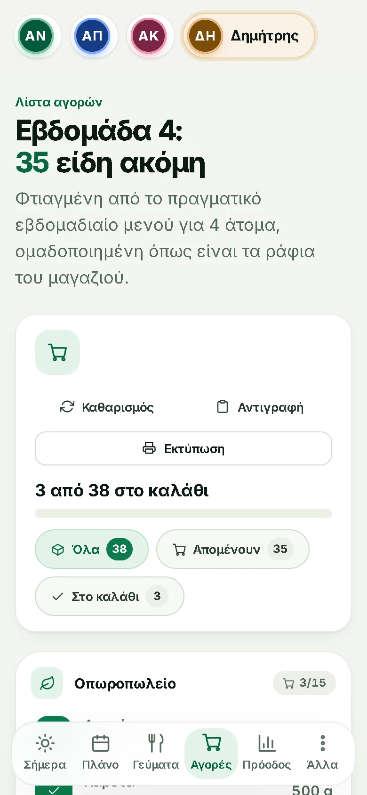
  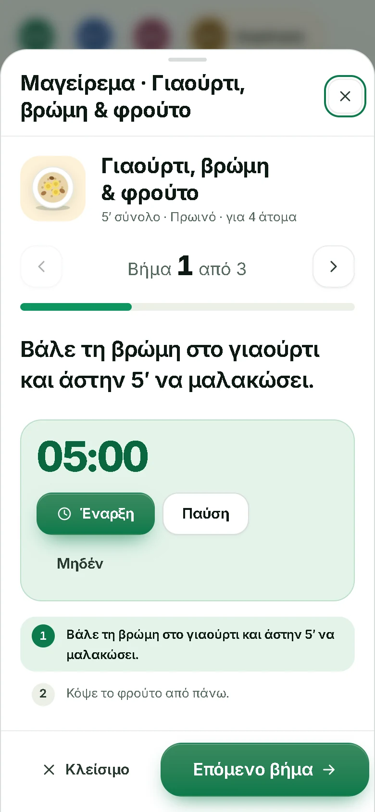
</p>

## What it does

| | |
|---|---|
| **Today** | The next meal, *your* plate for it in grams per ingredient, one tap to log it, water, and how the day is going against your targets. |
| **Plan** | A 28-day rotation (four different weeks), a week at a time, with each day's energy. Tap a day for the detail. |
| **Meals** | 28 recipes. Filter by meal or tag; every recipe shows the whole family's ingredients, each person's own plate, and per-serving nutrition. |
| **Cook Mode** | Big step-by-step text, a timer per step, an ingredient checklist and everyone's plate beside it. The next-step button never leaves the thumb. |
| **Shopping** | Built from the week you are actually looking at, merged by food, rounded *up* to the size you can buy, grouped by aisle, tick-off, and copy to a message. |
| **Progress** | Weigh-ins with a least-squares weekly trend (one reading is noise; the slope is the signal), a 28-day logging calendar, weekly adherence. |
| **Family** | Four profiles with their own energy, protein and fluid targets. Add, edit or remove members; export and restore a JSON backup; print. |
| **Guide** | The method, every source with the date it was checked, the safety rules and a glossary. |

Also: light and dark themes (following the device by default), a command palette (`Ctrl`/`⌘` + `K`), deep links
(`?view=plan`), keyboard access throughout, a print stylesheet, and full offline use once loaded.

<details>
<summary>More screens</summary>

| Plan | Meals | Shopping |
|---|---|---|
| 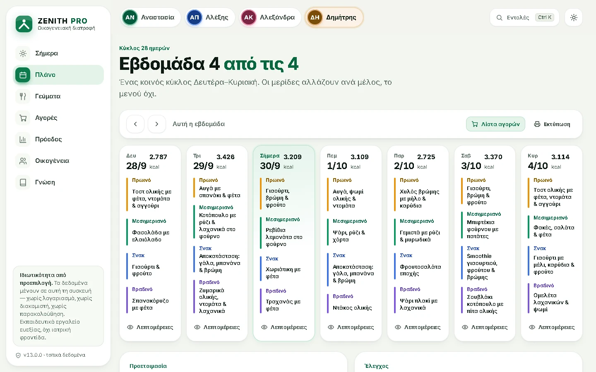 | 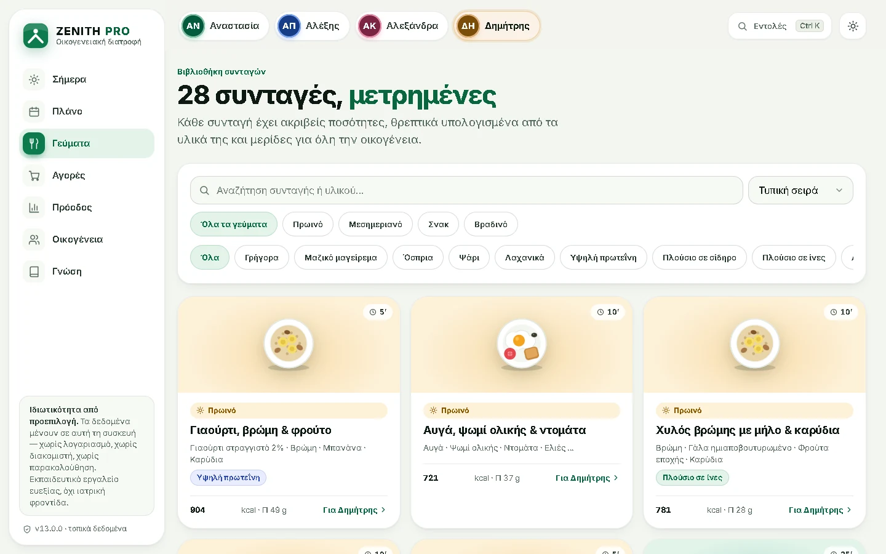 | 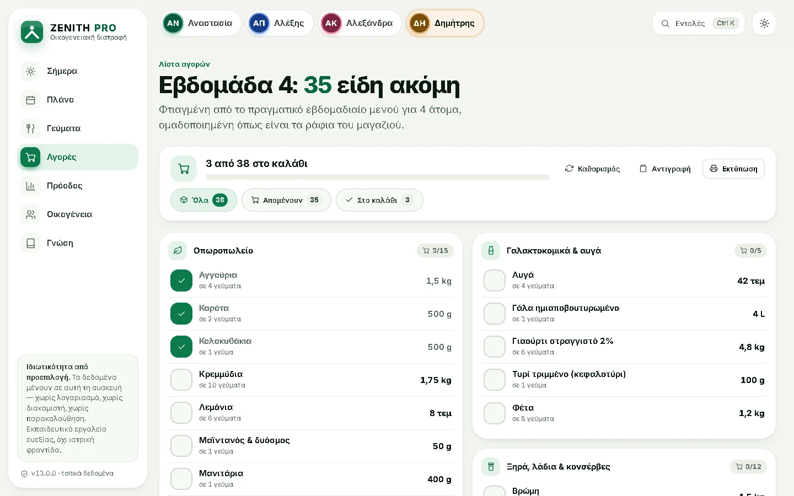 |
| **Progress** | **Family** | **Guide** |
| 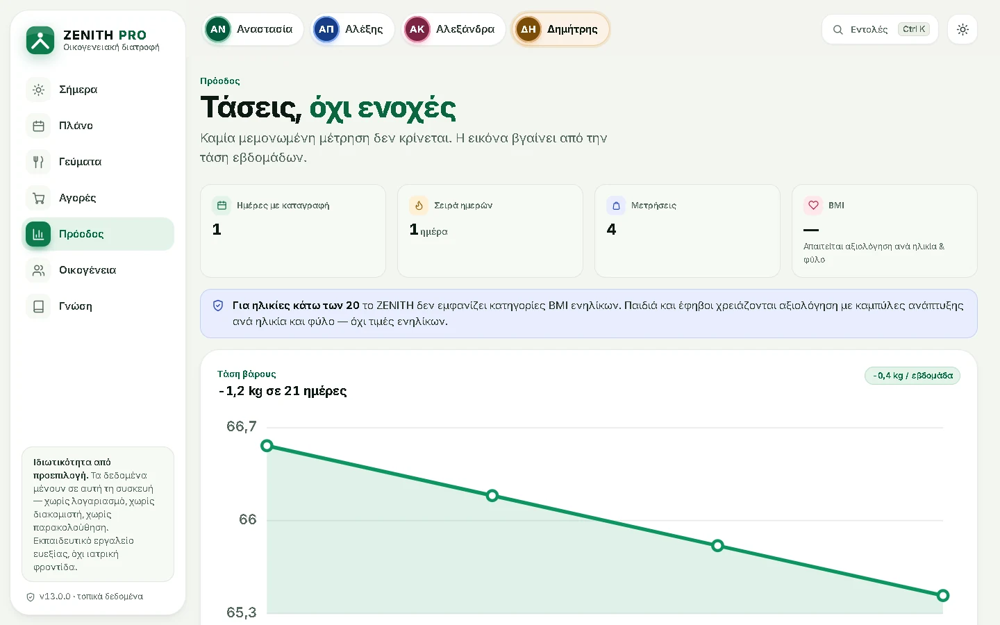 | 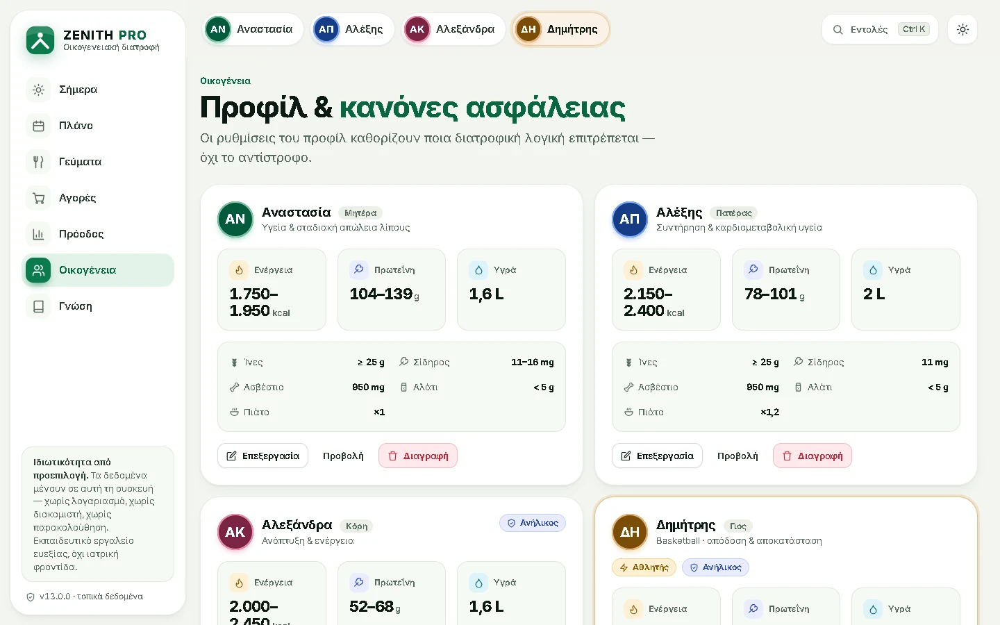 | 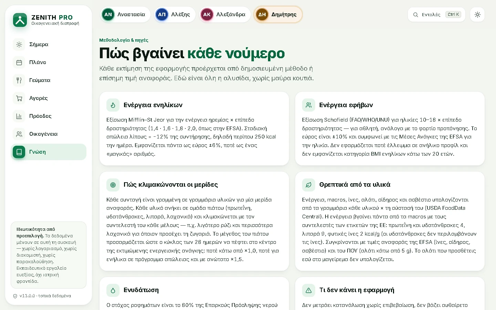 |
| **Recipe** | **Cook Mode** | **Dark · Meals** |
| 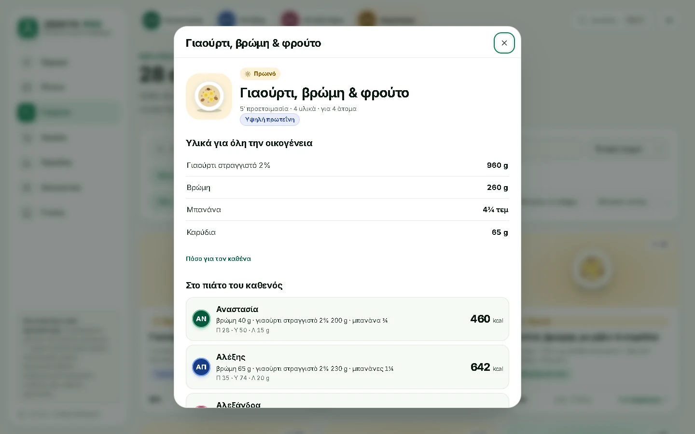 | 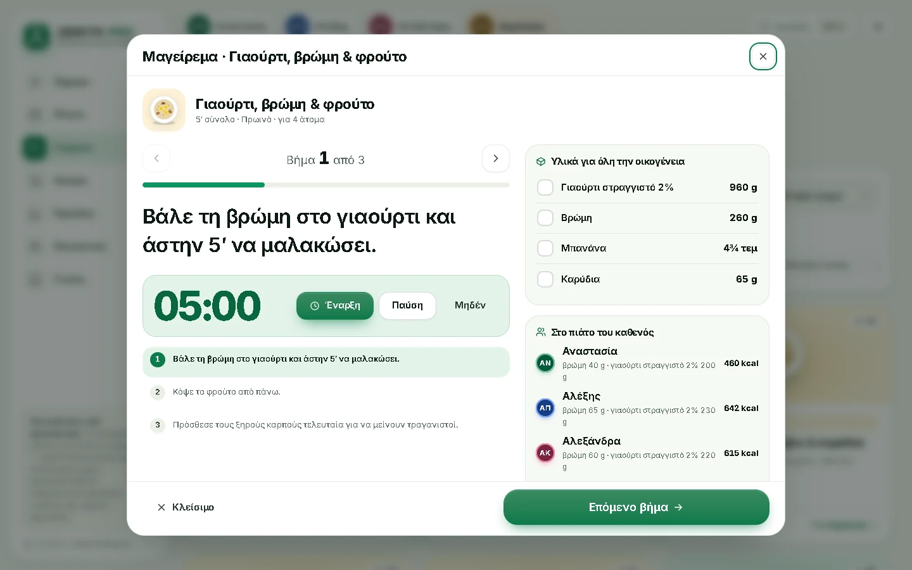 | 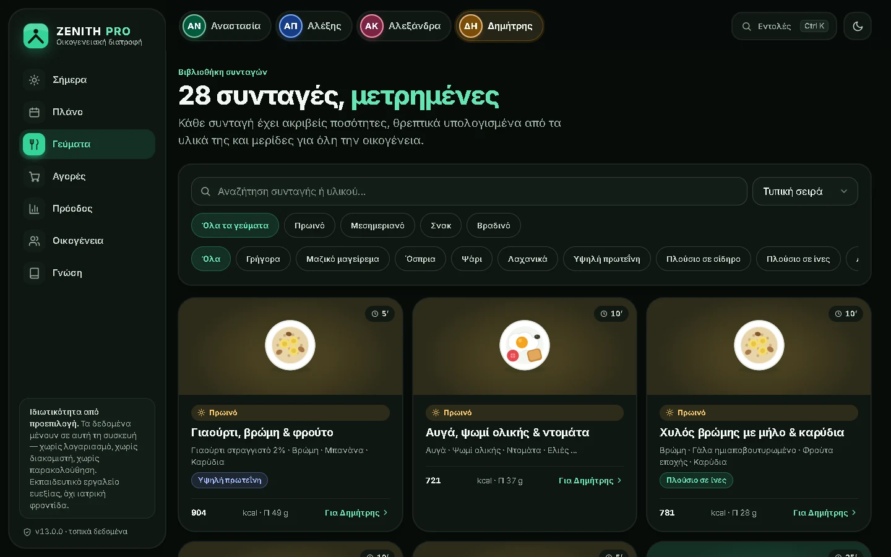 |

</details>

## Where the numbers come from

Nothing nutritional is typed into a recipe. The chain is short enough to audit end to end:

1. **Foods** — `src/foods.js` holds 41 foods per 100 g. 39 are records from **USDA FoodData Central** (34 exact, 5 documented proxies for
   regional foods); the other two are labelled approximations. The exact records are committed as a snapshot (`data/usda-fdc.json`,
   refreshed with `npm run data:usda`).
2. **Recipes** — `src/recipes.js` writes each recipe as quantified ingredient lines (`{ food, quantity, unit }`). Macronutrients and micronutrients
   are **derived** from those grams.
3. **Energy** — always computed from the macros with the EU labelling factors (Regulation (EU) 1169/2011, Annex XIV: protein 4, available
   carbohydrate 4, fat 9, fibre 2 kcal/g). Energy is never stored, so two screens cannot disagree.
4. **Targets** — resting energy from Mifflin–St Jeor (adults) and Schofield (10–18), activity on the EFSA physical-activity-level ladder
   (1.4 · 1.6 · 1.8 · 2.0), protein for goal and sport (ACSM/ISSN), fibre / calcium / iron against EFSA reference values, salt against WHO’s
   5 g, fluids from EFSA’s total-water intake (drinks are 80 % of it). The expected rate of weight change is shown as an approximation
   (≈ 7,700 kcal per kg — Hall et al. explain why the real response is slower). The Guide lists all twelve sources with the date each was
   last verified.

**This is enforced, not promised.** `tests/food-provenance.test.mjs` fails the build if any food differs from its USDA record by even a
digit, if an FDC id points at the wrong food (it caught eight mistyped ids while v13 was built), or if USDA’s own energy figure disagrees
with the one derived from the macros. `tests/menu.test.mjs` fails it if the 28-day rotation breaks its documented rules (every week has
three different legume lunches and two fish meals, red meat at most once, no dish two days running, never two egg dishes in a day), if a
reference day leaves the EFSA ranges (fat 20–35 % and carbohydrate 45–60 % of energy, fibre ≥ 25 g, food sodium under 2 g), or if a plate
is sized to anything but that person’s need — never below the base plate, and never scaled up for the adult on a fat-loss goal.

### Safety model

An educational wellness tool, not medical care. **No deficit goal and no adult BMI category is offered below age 20.** The rule lives in
the nutrition engine and is applied again when a profile is saved, so it cannot be bypassed from the form. Adolescent profiles are
planned for growth or sport performance; the Guide explains RED-S (relative energy deficiency in sport) and why a deficit is never offered.

## Privacy & security

All data stays in the browser (IndexedDB, with a localStorage fallback). There is no account, no server, no analytics and no third-party
request: a strict Content-Security-Policy (`default-src 'self'`, no inline script) and the audits below both confirm the app never talks to
another origin. The typeface (Inter Variable, Greek + Latin) is self-hosted. There are **zero runtime dependencies**.

## Architecture

```
index.html               App shell: CSP, preloads, landmarks
styles/tokens.css        Design tokens — the only place the two themes differ
styles/base.css          Reset, layout, the three responsive shells (sidebar · rail · floating tab bar)
styles/components.css    Buttons, chips, cards, sheets, toasts, forms
styles/views.css         Per-view layout
styles/print.css         Print stylesheet
src/dates.js             Calendar-day arithmetic — the plan can never shift with DST or timezone
src/foods.js             41 foods per 100 g with USDA FDC ids
src/recipes.js           28 recipes as quantified lines, plus the 28-day rotation
src/data.js              Profiles, sources, method, safety text, glossary
src/nutrition-engine.js  Pure functions: physiology, plate model, shopping list, statistics
src/storage.js           IndexedDB (+ localStorage fallback), backup and import
src/ui.js · art.js       Rendering primitives, icons, charts · 19 inline-SVG plate illustrations
src/views.js             Pure view functions that return HTML strings
src/app.js               State, routing, one delegated `data-act` click dispatcher
sw.js                    Network-first navigation, stale-while-revalidate assets
```

Views are pure functions returning HTML with `data-act` attributes; `app.js` owns all state and handles every interaction through one
delegated listener. There is no build step — edit a file, reload.

## Develop

```bash
npm install          # dev tools only (jsdom, fake-indexeddb, axe-core)
npm run serve        # http://127.0.0.1:8137/
npm run verify       # syntax · all test suites · PWA integrity · DOM smoke test
```

| Command | What it proves |
|---|---|
| `npm test` | Engine maths, data integrity, **USDA provenance**, menu rules, EFSA reference values, personas, and the plan across 8 timezones. |
| `npm run smoke` | Boots the real `index.html` in jsdom and drives every view and interaction, on both storage backends. |
| `npm run verify:pwa` | Every precached file exists, every module the app imports is precached, versions agree, the manifest and its icons are valid, the CSP forbids inline script. |
| `npm run audit:layout` | Real Chromium at phone width: no horizontal overflow, touch targets ≥ 36 px, Cook Mode navigation pinned. |
| `npm run audit:a11y` | **axe-core** (WCAG 2.2 A/AA + best practice) on every view and overlay — phone and desktop, light and dark, all four members, first run and with data. |
| `npm run audit:contrast` | WCAG contrast **measured from rendered pixels** for every text run (axe cannot decide text over tints and gradients). |
| `npm run shots` | Regenerates the screenshots in `docs/`, the install-dialog images and the social card. |

The browser audits need Python with `playwright numpy pillow` and the app served on port 8137. Add `--quick` for a faster matrix.
CI runs everything: the quick browser matrix on branches, the full one on `main`. After each deploy, *Production Smoke* waits for GitHub
Pages to serve that exact build and checks that every precached file is really live.

Refreshing food data: `USDA_API_KEY=… npm run data:usda` (or `node scripts/fetch_usda.mjs --portal`, which uses the public FoodData Central
site), then `npm test` — the provenance test will say what changed.

## Licence

See [`LICENSE`](LICENSE). Font: Inter, SIL Open Font Licence 1.1 (`assets/fonts/`).
